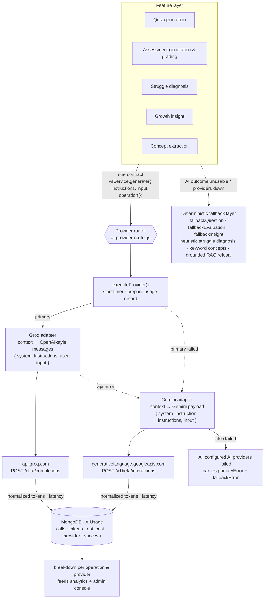
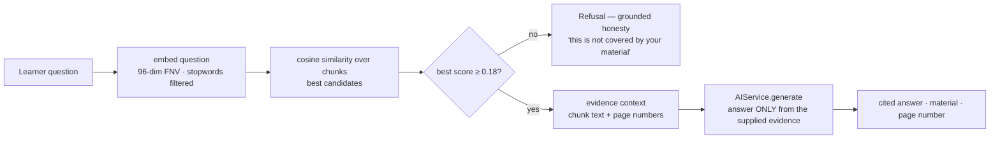
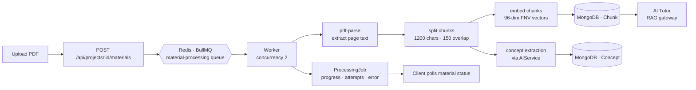
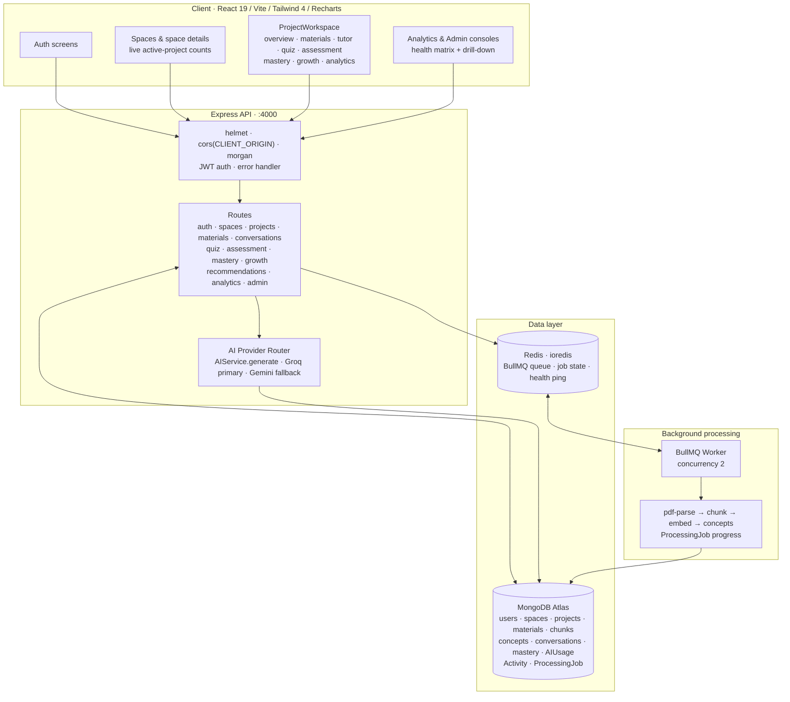

# AI Study Companion

A modular-monolith studying platform where your own material becomes a grounded study experience — upload a PDF, and the app builds a private tutor, adaptive quizzes, open-ended assessments, and a measurable mastery model from it. Designed to stay useful when AI providers fail: every AI call is routed, measured, and backed by a deterministic fallback.

## Table of contents

- [What it does](#what-it-does)
- [Features](#features)
- [AI resilience: how LLM calls stay reliable](#ai-resilience-how-llm-calls-stay-reliable)
- [Redis: the job backbone](#redis-the-job-backbone)
- [Architecture](#architecture)
- [Tech stack](#tech-stack)
- [Repository layout](#repository-layout)
- [Run locally](#run-locally)
- [Environment variables](#environment-variables)
- [Testing](#testing)
- [API surface](#api-surface)
- [Deployment](#deployment)
- [Documentation](#documentation)

## What it does

1. A learner creates a **Space** (a study area) and adds **Projects** with a learning goal.
2. They upload **source PDFs**. The upload returns immediately with a `QUEUED` material; a Redis-backed worker extracts the text, splits it into overlapping **chunks**, and computes a **local dense embedding** for each chunk.
3. An **AI Tutor** answers questions from the learner **only** using those chunks (retrieval-augmented generation with evidence thresholding and page citations).
4. The platform generates **quizzes**, **open-ended assessments**, and a **concept mastery model** from the material. Recommendations, growth timelines, per-project/global analytics, and an **admin console** close the loop.

## Features

**Study spaces and projects**
- Spaces group projects; each project tracks a learning goal, uploaded materials, conversations, practice history, and analytics. Projects expose live active-project counts and are archived rather than hard-deleted.

**Material processing pipeline**
- PDF uploads return instantly with a queued job (`POST /api/projects/:id/materials`). The worker extracts text with `pdf-parse`, builds overlapping chunks (1200 characters, 150 overlap), and computes 96-dimension hashed-FNV embeddings locally — no external vector database required.

**Grounded AI tutor (RAG)**
- A single provider-agnostic contract (`AIService.generate()`) powers the tutor. Retrieval ranks the top 5 chunks by cosine similarity against the question; when the best evidence scores below the 0.18 evidence threshold, the tutor refuses to answer rather than hallucinate, and it cites the source material and page.
- Tutor chats persist as conversations with role-based messages.

**Adaptive quizzes**
- Quizzes are generated per concept set with adjustable question counts. The quiz engine validates structured JSON output strictly and falls back to a deterministic question template when the AI reply cannot be parsed.
- Answers are graded instantly; scores feed a **mastery model** (per-concept `currentMastery`, attempt/correct evidence counts, level tiers) with deltas recorded over time so reviewers can reason about student learning.

**Open-ended assessments**
- AI-generated questions keyed to concepts; a grader model scores answers against a rubric, extracts strengths, misconceptions, and gaps, and emits a written summary. A deterministic `fallbackEvaluation` keeps grading available when the AI call fails.

**Struggle diagnosis**
- For a concept, the app fuses quiz misses, assessment misconceptions, and tutor questions into an evidence dossier, grounds it back to the exact PDF page, and asks the AI to diagnose the repeating mistake. If diagnosis is unavailable, a heuristic insight with concrete recommendations is shown instead.

**Growth trends**
- Mastery history is bucketed into weekly timelines; an AI learning analyst writes a short insight, replaced by a data-driven `fallbackInsight` if generation fails.

**Recommendations**
- Personalized action sets (review the material page, ask the tutor a contrast question, retry missed questions, take a focused quiz, follow a study plan) are built with `buildEvidence`/`buildWhy` so every recommendation is attributable.

**Analytics**
- Per-project and global dashboards (Recharts): sessions, tutor usage, quiz accuracy by answer, mastery level distribution, activity feed, and AI usage breakdown (calls, success/failure, tokens, latency, estimated cost, provider mix).

**Admin console**
- Role-gated admin view with a live health matrix (API / Database / Redis / AI / Worker), global totals and AI usage, user list with a slide-over drill-down into any account, and evaluation-run history.

## AI resilience: how LLM calls stay reliable

Every LLM interaction flows through `server/src/services/ai-provider-router.js`. Nothing in the app calls a vendor SDK directly.

**Provider routing and per-LLM context management**



**How context is managed per LLM.** The router never mixes vendor vocabulary into the features. Every feature sends one provider-agnostic contract — a system `instructions` block plus the `input` — and each adapter is responsible for translating that context into its provider's native request shape. Groq receives a standard OpenAI-style `messages` array (`system` / `user` roles); Gemini receives its own `system_instruction` + `input` fields. Adding a third provider means writing one adapter, not touching a single feature. Token usage is normalized as each adapter reads its provider's usage payload, so cost and latency accounting stays comparable across vendors.

1. **Multi-provider router.** Groq is the primary provider and Gemini is the fallback (`AIService.generate()` tries the primary, then the fallback, and only then raises `All configured AI providers failed` carrying both underlying errors). Providers are thin `fetch` adapters with normalized response reading.
2. **Token and cost accounting.** Prompt/output token counts are normalized across the two providers' response shapes. A per-model pricing table (`openai/gpt-oss-120b`, `gemini-2.5-flash`) drives `estimateCost()` per 1M tokens, and every call records latency.
3. **Best-effort usage persistence.** Every execution writes an `AIUsage` document (tokens, cost, latency, provider, operation, and success/failure with an error snippet). Persistence failures are swallowed so telemetry can never take down a feature.
4. **Strict structured-output validation.** The quiz, assessment, struggle-diagnosis, and growth-insight consumers parse and structurally validate JSON (`parseJsonText`, key checks, length caps) before trusting AI output.
5. **Deterministic fallbacks.** When generation or parsing fails, each feature degrades gracefully to a deterministic implementation — `fallbackQuestion`, `fallbackEvaluation`, `fallbackInsight`, keyword/statistical concept extraction, and heuristic struggle diagnosis. The platform stays usable with AI unreachable or unconfigured.
6. **Grounded refusal.** The knowledge engine returns a refusal instead of a confident guess when retrieved evidence is too weak, so the tutor never fabricates answers.
7. **Health visibility.** `/api/health` and `/api/ready` report API, MongoDB, and Redis status; the admin console surfaces AI provider status for operators.

**Grounded answering gateway (knowledge engine)**

The tutor does not just forward questions to the LLM — a retrieval gateway decides whether the AI is even allowed to answer:



## Redis: the job backbone

Redis is a first-class dependency accessed continuously for material processing:

- `server/src/services/material-queue.js` exposes a BullMQ `material-processing` queue connected through `REDIS_URL` (ioredis). Uploads `queue.add()` jobs that return immediately to the client.
- `server/src/workers/material.worker.js` runs a BullMQ Worker (`concurrency: 2`) that executes jobs: PDF text extraction, chunking, embeddings, and AI concept extraction, updating `ProcessingJob` progress in MongoDB.
- Jobs are hardened for failure: **3 attempts** with **exponential backoff starting at 2000 ms**, so transient LLM or parse failures retry automatically; completed/failed jobs are retained in Redis (last 100 each) for observability.
- The queue is the reason the platform stays responsive during long processing, and it centralizes retry, concurrency, and job-state bookkeeping in Redis rather than in the app process.



Redis also powers the admin health check (a PING from the app's ioredis client, connected with `lazyConnect`).

> Local Redis is provided by `docker-compose.yml`; production uses Upstash (`rediss://`).

## Architecture



## Tech stack

| Layer       | Technology |
| ----------- | ---------- |
| Client      | React 19, Vite 8, Tailwind CSS 4, Recharts, oxlint |
| Server      | Node.js (ESM), Express 5, Mongoose 8, jsonwebtoken, bcryptjs |
| Queuing     | BullMQ 6 + ioredis on Redis |
| Storage     | MongoDB Atlas (document database), Redis (job/queue state) |
| AI          | Provider-agnostic router: Groq (primary), Gemini (fallback) |
| Security    | helmet, CORS allow-list from `CLIENT_ORIGIN`, JWT bearer auth |
| Processing  | pdf-parse for PDF text; local FNV-hashed vector embeddings (no vector DB) |
| Testing     | Node built-in test runner (`server/tests/*.test.mjs`, 65 spec files) |

## Repository layout

```
├── client/                 React 19 + Vite + Tailwind 4 UI
│   └── src/components/     AuthScreens, Spaces, SpaceDetail, ProjectWorkspace,
│                            AnalyticsDashboard, AdminDashboard
├── server/
│   ├── src/app.js          Express app, route mounting, health/ready checks
│   ├── src/models/         Mongoose schemas
│   ├── src/routes/         REST routers under /api
│   ├── src/services/       Business logic + AIService router + engines
│   ├── src/workers/        BullMQ Redis worker
│   ├── src/middleware/     Auth, error handling
│   └── tests/              Node test runner spec files
├── docs/                   architecture, decisions, AI prompts, evaluation
└── docker-compose.yml      Local Redis for development
```

## Run locally

Requirements: Node.js 18+, MongoDB Atlas (or local MongoDB), Redis, and API keys for Groq/Gemini (optional — the app runs with deterministic fallbacks without them).

```powershell
# 1) Environment
Copy-Item .env.example .env
#    Edit .env: paste MONGODB_URI, REDIS_URL, GROQ_API_KEY, GEMINI_API_KEY
#    IMPORTANT: URL-encode special characters in the Atlas password.

# 2) Redis (local)
docker compose up -d

# 3) API  (requires --openssl-legacy-provider on systems with OpenSSL 3.x)
cd server
npm install
$env:NODE_OPTIONS="--openssl-legacy-provider"
npm run dev

# 4) PDF processing worker (separate terminal)
cd server
npm run worker

# 5) Client (another terminal)
cd client
npm install
npm run dev
```

- Client: `http://localhost:5173`
- API health: `http://localhost:4000/api/health` · readiness: `http://localhost:4000/api/ready`
- Auth: `POST /api/auth/register`, `POST /api/auth/login`, `GET /api/auth/me` — send the returned token as `Authorization: Bearer <token>`.

## Environment variables

| Variable          | Purpose |
| ----------------- | ------- |
| `PORT`            | API listen port (default 4000) |
| `MONGODB_URI`     | MongoDB Atlas connection string (database `test` in current deployment) |
| `REDIS_URL`       | Redis connection string for BullMQ and health checks |
| `CLIENT_ORIGIN`   | Exact CORS allow-list origin (must match the deployed client URL) |
| `GROQ_API_KEY`    | Primary AI provider key + `GROQ_MODEL` (default `openai/gpt-oss-120b`) |
| `GEMINI_API_KEY`  | Fallback AI provider key + `GEMINI_MODEL` (default `gemini-2.5-flash`) |
| `JWT_SECRET`      | Token signing secret |
| `STORAGE_DIRECTORY` | Local directory where uploaded files live |

Secrets stay in `.env` (gitignored); nothing sensitive is ever committed.

## Testing

```powershell
cd server
npm test        # node --test --test-timeout=120000 "tests/*.test.mjs"  (65 spec files)
```

The client lints with `oxlint` and builds with `vite build`.

## API surface

Major routes under `/api`:

- `auth` — register / login / me
- `spaces` — CRUD + live active-project counts
- `projects` — CRUD, materials, learning goals
- `materials` — upload, queue, processing status
- `conversations` — tutor chat (RAG-grounded answers)
- `quiz` — generated quizzes, attempts, grading, mastery updates
- `assessment` — open-ended questions, AI grading, evaluation runs
- `mastery` — concept mastery model
- `growth` — weekly growth timeline + AI insight
- `recommendations` — evidence-backed action sets
- `analytics` — project + global analytics
- `admin` — overview, users, evaluations, health

## Deployment

- **API + worker**: Render Web Service (server root, start with the worker in the same container, e.g. `sh -c "node src/app.js & node src/workers/material.worker.js & wait"`). Attach a shared disk at the configured `STORAGE_DIRECTORY` so both processes read the same uploads.
- **Client**: Vercel (client root, `VITE_API_URL` set at build time). `CLIENT_ORIGIN` must equal the exact deployed URL.
- **Redis**: Upstash (`rediss://`) — verified working with this codebase.
- **Database**: MongoDB Atlas; the connection string stays in the server environment, never in source control.
- Monitoring: the `/api/ready` endpoint degrades to 503 (with per-dependency status) when MongoDB or Redis is unreachable, so uptime checks reflect real readiness.

## Documentation

- `docs/architecture.md` — system architecture and data flow
- `docs/decisions.md` — design decisions
- `docs/ai-prompts.md` — AI prompt contracts
- `docs/evaluation.md` — evaluation path and rubric approach